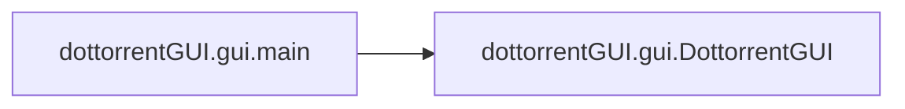

# Dottorrentgui Gui

[_Documentation generated by Documatic_](https://www.documatic.com)

<!---Documatic-section-Codebase Structure-start--->
## Codebase Structure

<!---Documatic-block-system_architecture-start--->
```mermaid
None
```
<!---Documatic-block-system_architecture-end--->

# #
<!---Documatic-section-Codebase Structure-end--->

<!---Documatic-section-dottorrentGUI.gui.main-start--->
## dottorrentGUI.gui.main

<!---Documatic-section-main-start--->


### Object Calls

* dottorrentGUI.gui.DottorrentGUI

<!---Documatic-block-dottorrentGUI.gui.main-start--->
<details>
	<summary><code>dottorrentGUI.gui.main</code> code snippet</summary>

```python
def main():
    app = QtWidgets.QApplication(sys.argv)
    MainWindow = QtWidgets.QMainWindow()
    ui = DottorrentGUI()
    ui.setupUi(MainWindow)
    MainWindow.setWindowTitle(PROGRAM_NAME_VERSION)
    ui.loadSettings()
    ui.clipboard = app.clipboard
    app.aboutToQuit.connect(lambda : ui.saveSettings())
    MainWindow.show()
    sys.exit(app.exec_())
```
</details>
<!---Documatic-block-dottorrentGUI.gui.main-end--->
<!---Documatic-section-main-end--->

# #
<!---Documatic-section-dottorrentGUI.gui.main-end--->

[_Documentation generated by Documatic_](https://www.documatic.com)